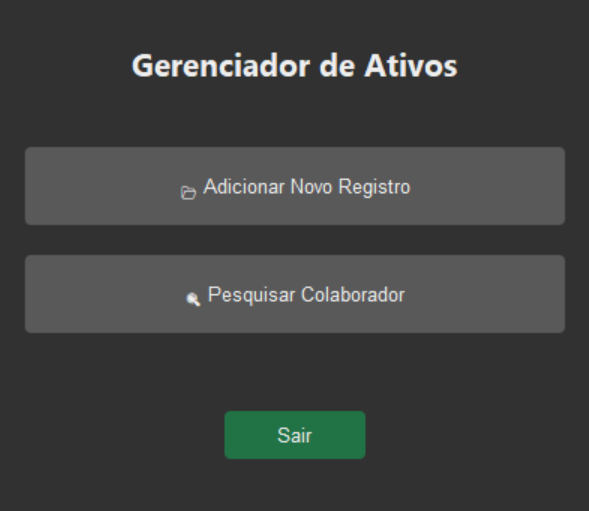
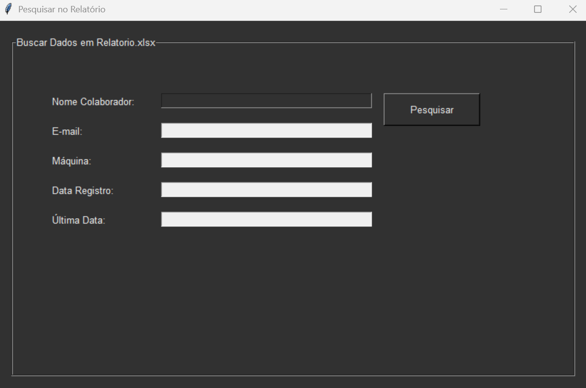
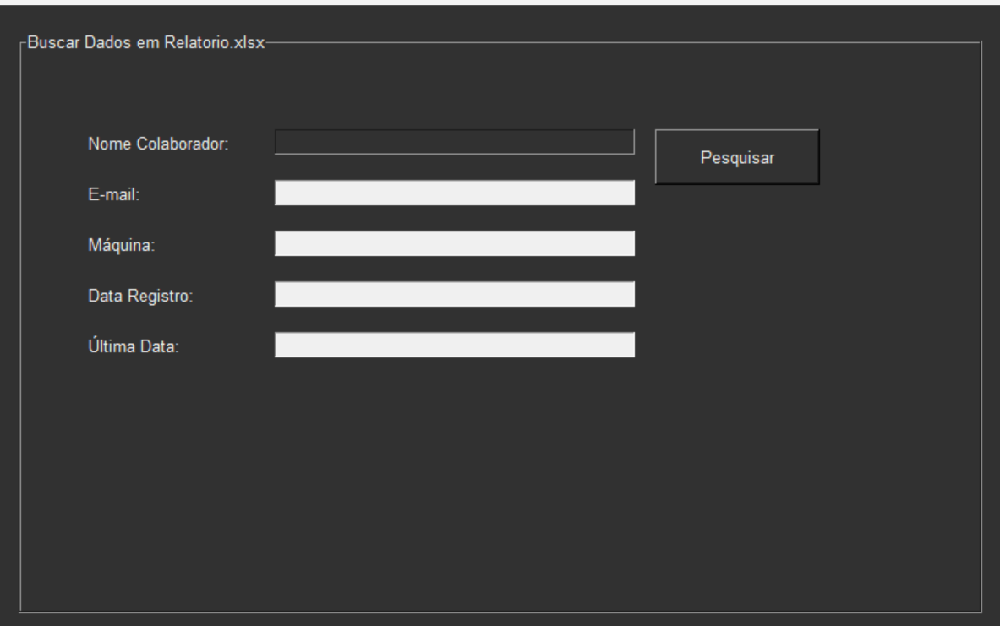

# 📊 Excel Tools Suite

> **Automatize, Cadastre e Busque.** 


---

## 🧐 O que é isso?

Este projeto é uma **Suite de Ferramentas Desktop** desenvolvida para facilitar a gestão de ativos e colaboradores. Ao invés de lidar diretamente com células frágeis do Excel, o usuário interage com uma interface gráfica moderna.

O sistema centraliza tudo em um único banco de dados (`Relatorio.xlsx`), garantindo que o cadastro e a busca "bebam da mesma água".

---

## 📸 Screenshots

Dê uma olhada em como ficou o visual

### 📂 Painel Principal
_O hub central que conecta suas ferramentas._
<div align="center">
  
</div>

### 📝 Módulo de Cadastro
_Validação de dados e inserção segura com suporte a temas._
<div align="center">
  
</div>

### 🔍 Módulo de Busca
_Encontre qualquer colaborador pelo nome em milissegundos._
<div align="center">
  
</div>

---

## 🛠️ Arquitetura do Projeto

O projeto foi estruturado para ser **escalável**. 

```text
EXCEL-TOOLS-SUITE/
│
├── data/                  # Banco de Dados (Excel)
│   └── Relatorio.xlsx
│
├── modulos/               # Cérebro da aplicação
│   ├── busca.py           # Lógica de pesquisa
│   └── cadastro.py        # Lógica de inserção
│
├── theme/                 # Estilização (Forest Theme)
│   └── ...
│
├── main.py                # Menu Principal
└── README.md              
